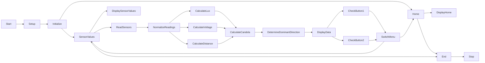

# Light Sensing and Direction Detection System (candela meter) using Arduino Nano

## Table of content

1. [Introduction](#introduction)
2. [Hardware Requirements](#hardware-requirements)
3. [Libraries Used](#libraries-used)
4. [Pin Configuration](#pin-configuration)
5. [Functionality](#functionality)
6. [Usage](#usage)
7. [Flowchart](#flowchart)
8. [Simulation](#simulation)
9. [Image](#image)
10. [Support](#support)

## Introduction

This Arduino code is designed to create a light sensing and direction detection system using an Arduino Nano microcontroller. The system utilizes LDRs (Light Dependent Resistors) to measure light levels in various directions and displays the results on an I2C-connected LCD screen.

## Hardware Requirements

- Arduino Nano
- I2C LCD screen (20x4 characters)
- Four LDRs (Light Dependent Resistors)
- Two push buttons (for menu navigation)
- Voltage and distance sensors (here i use 2 pot)(analog)
- Appropriate power source for the Arduino Nano

## Libraries Used

The code makes use of the following libraries:

- Wire.h: For I2C communication with the LCD screen.
- LiquidCrystal_I2C.h: To interface with and control the I2C-connected LCD screen.

## Pin Configuration

The Arduino Nano is connected to various components as follows:

- LDRs:
  - LDR positioned at the top: Analog pin A0
  - LDR positioned on the right: Analog pin A1
  - LDR positioned at the bottom: Analog pin A2
  - LDR positioned on the left: Analog pin A3
- Voltage measurement: Analog pin A6
- Distance measurement: Analog pin A7
- Menu navigation buttons:
  - Button 1: Digital pin 2
  - Button 2: Digital pin 3
- I2C-connected LCD screen:
  - LCD Address: 0x27
  - LCD Dimensions: 20x4 characters

## Functionality

The code functions as follows:

- It continuously reads values from the LDRs, voltage sensor, and distance sensor at regular intervals.
- Normalizes and maps the sensor readings to calculate lux, voltage, and distance values.
- Uses the obtained values to calculate the candela value for each of the four directions (Top, Right, Bottom, and Left).
- Determines the dominant direction based on the highest candela value.
- Displays the calculated candela values and dominant direction on the LCD screen.
- Provides two menus:
  - Home: Displays the average candela value and the dominant direction.
  - Sensor Values: Displays individual candela values for each direction.
- Menu navigation is achieved using two push buttons.

## Usage

1. Upload this code to your Arduino Nano using the Arduino IDE or a compatible software.
2. Connect the components as per the provided pin configuration.
3. Power up the Arduino Nano.
4. The system will display the calculated values on the LCD screen and allow you to switch between Home and Sensor Values menus using the push buttons.

## Flowchart

## Simulation

[wokwi simmulation](https://wokwi.com/projects/379985688564603905)

## Image

## Support

You can support me by buy me a coffee if u like to.

<!--   <h4>And you can also support me by <a href="https://www.buymeacoffee.com/azzar" target="_blank">buying me coffee</a></h4> -->
  

