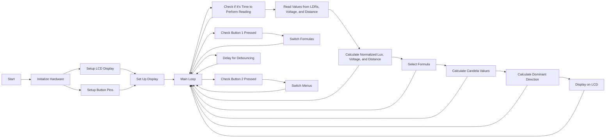

# Light Sensing and Direction Detection System (candela meter) using arduino nano

This README provides a comprehensive overview of the code for a light sensing and direction detection system. The code is written for an Arduino microcontroller and utilizes LDRs (Light Dependent Resistors) to measure light levels in different directions and determine the dominant direction.

## Table of Contents

1. [Introduction](#1-introduction)
2. [Hardware Components](#2-hardware-components)
3. [Software Components](#3-software-components)
4. [Usage](#4-usage)
5. [Formulas](#5-formulas)
6. [Menu System](#6-menu-system)
7. [Functions](#7-functions)
8. [Flowchart](#8-flowchart)
9. [Simulation](#9-simulation-and-diagram)
10. [Troubleshooting](#10-troubleshooting)
11. [Support](#11-support)

## 1. Introduction

This code is designed to operate a light sensing and direction detection system using an Arduino microcontroller and a 20x4 I2C LCD display. It utilizes LDRs (Light Dependent Resistors) to measure the light levels in four different directions: top, right, bottom, and left. The system calculates the candela values for each direction and determines the dominant direction based on the highest candela value.

## 2. Hardware Components

### Components Used:

- Arduino Microcontroller
- 20x4 I2C LCD Display
- Four LDRs (Light Dependent Resistors)
- Two Push Buttons
- Voltage and distance sensors (here we use two potentiometers as analog sensors)

## 3. Software Components

### Libraries Used:

- Wire.h: For I2C communication.
- LiquidCrystal_I2C.h: For interfacing with the LCD display.

## 4. Usage

The system works by continuously measuring light levels in the specified directions and updating the LCD display. You can switch between different formulas for calculating candela values and toggle between two menu screens: the home screen and the sensor values screen.

## 5. Formulas

The system supports three different formulas for calculating candela values:

1. **Formula 1:** Candela values are calculated based on the formula `(lux / (4 * π * (distance * distance) * voltage))`, assuming a spherical area.
2. **Formula 2:** Candela values are calculated using the formula `((lux * 4 * π * (distance * distance)) / (voltage * (distance * distance)))`.
3. **Formula 3:** Candela values are calculated as `(area * (lux / voltage))`, assuming a spherical area.

You can switch between these formulas using the provided buttons.

## 6. Menu System

The system has two menu screens:

- **Home Screen:** Displays the average candela value and the dominant direction.
- **Sensor Values Screen:** Displays individual candela values for each direction (top, right, bottom, left).

You can switch between these screens using the provided buttons.

## 7. Functions

The code includes several functions to manage the operation of the system:

- `setup()`: Initializes the hardware components, including the LCD display, buttons, and serial communication.
- `loop()`: The main loop that continuously measures light levels, calculates candela values, determines the dominant direction, and updates the LCD display.
- `displayHome()`: Displays the home screen on the LCD, showing the average candela and dominant direction.
- `displaysensorval()`: Displays the sensor values screen on the LCD, showing individual candela values for each direction.

## 8. Flowchart

## 9. Simulation and diagram

[wokwi](https://wokwi.com/projects/379985688564603905)

## 10. Troubleshooting

If you encounter any issues or need to modify the code, please refer to the comments within the code for more detailed explanations of each section. You can also adjust the pin assignments and parameters as needed for your specific hardware setup.

**Note**: Ensure that you have the required libraries installed in your Arduino IDE, Make sure to connect the hardware components as per your specific configuration.

## 11. Support

You can support me by buy me a coffee if u like to.

<!--   <h4>And you can also support me by <a href="https://www.buymeacoffee.com/azzar" target="_blank">buying me coffee</a></h4> -->
  

